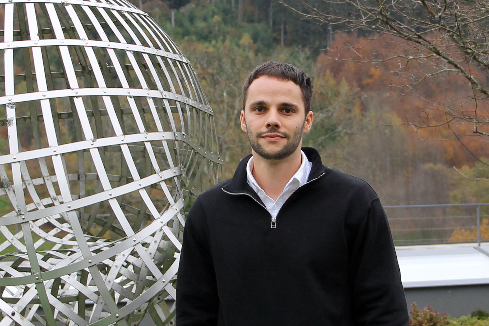

::: {.home-container}

:::: {.home-grid}

::: {.home-text}

I am <strong>Luca Pelizzari</strong>, a postdoctoral researcher in applied mathematics in the <a href="https://quarimafi.univie.ac.at">group of Christa Cuchiero</a> at the University of Vienna. I obtained my PhD in 2025 under the supervision of <a href="https://www.wias-berlin.de/people/bayerc/">Christian Bayer</a> and <a href="https://page.math.tu-berlin.de/~friz/">Peter Friz</a> at WIAS and TU Berlin.

My research develops mathematical foundations for stochastic models with memory, with applications to mathematical finance and machine learning. I am particularly interested in rough paths and signatures, stochastic Volterra equations, stochastic volatility models, and learning methods for non-Markovian data.

<a href="mailto:luca.pelizzari@univie.ac.at"><i class="fa-solid fa-envelope"></i> Email</a><a href="https://github.com/lucapelizzari"><i class="fa-brands fa-github"></i> GitHub</a><a href="https://scholar.google.com/citations?user=YZnumj8AAAAJ&hl=de"><i class="fa-solid fa-graduation-cap"></i> Google Scholar</a><a href="cv.qmd"><i class="fa-solid fa-file-lines"></i> CV</a>

:::

::: {.home-photo}

{fig-alt="Photo of Luca Pelizzari"}

:::

::::

::: {.new-heading}
## New preprints

[All publications](publications.qmd)
:::

::: {.paper-list}

- **[Expected signatures via partial integration, coordinate change and symmetrization](https://arxiv.org/abs/2607.29534)**  
  with Paul Hager.  
  arXiv:2607.29534, August 2026.

- **[Computational aspects of the Volterra Signature](https://arxiv.org/abs/2605.18406)**  
  with Paul Hager, Fabian Harang and Samy Tindel.  
  arXiv:2605.18406, May 2026.

- **[The Volterra Signature](https://arxiv.org/abs/2603.04525)**  
  with Paul Hager, Fabian Harang and Samy Tindel.  
  arXiv:2603.04525, March 2026.

:::
